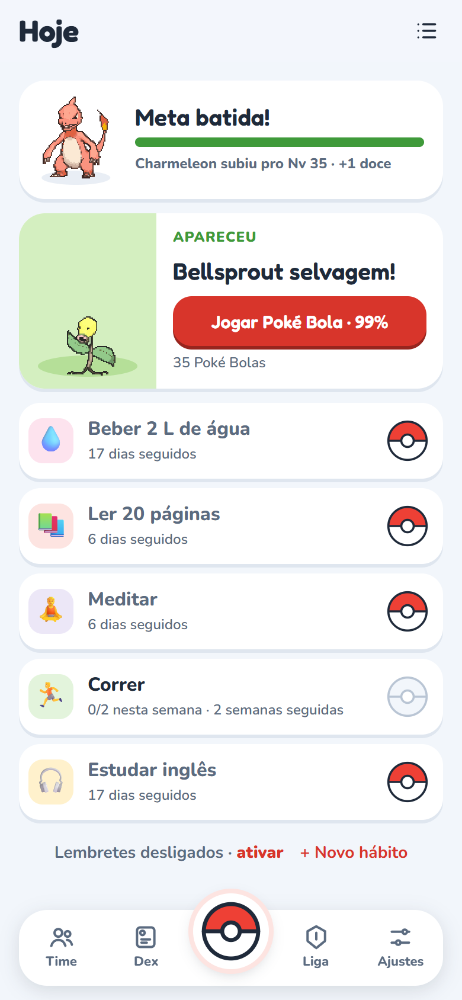
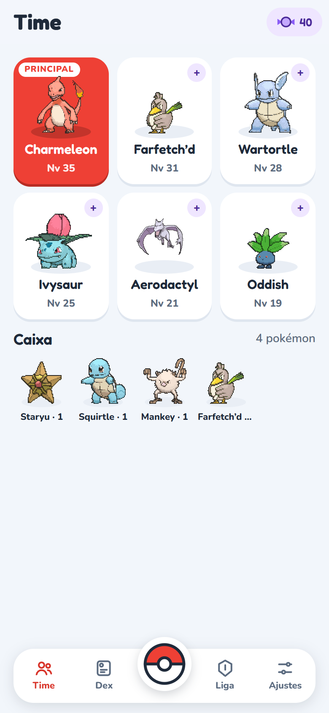
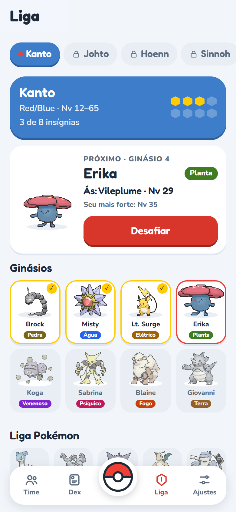
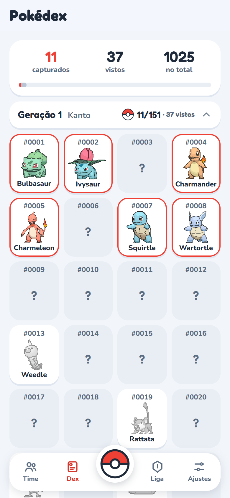
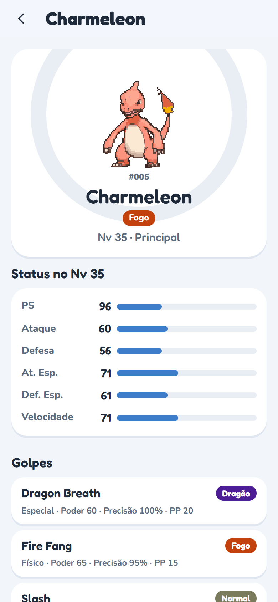
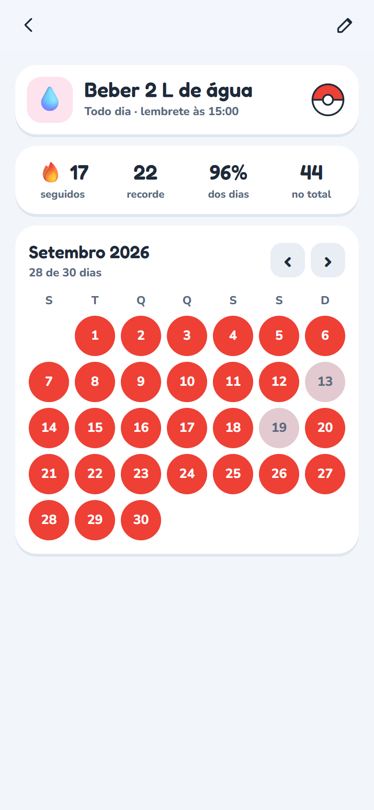
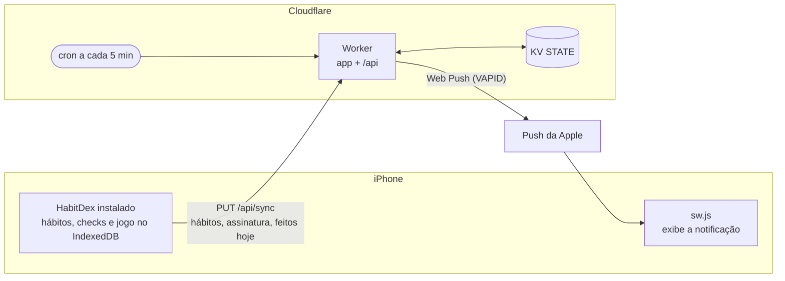

<p align="center">
  
</p>

<h1 align="center">HabitDex</h1>

<p align="center">
  Tracker de hábitos no iPhone em que cada dia na meta faz seu time de Pokémon subir de nível.
</p>

<p align="center">
  <a href="https://github.com/nathanwag/habitdex/actions/workflows/deploy.yml"></a>
  
  
  
  <a href="LICENSE.md"></a>
</p>

<table align="center">
  <tr>
    <td align="center">
      <picture>
        <source media="(prefers-color-scheme: dark)" srcset="docs/screenshots/hoje-dark.png">
        
      </picture>
      <br><sub><b>Hoje</b></sub>
    </td>
    <td align="center">
      <picture>
        <source media="(prefers-color-scheme: dark)" srcset="docs/screenshots/time-dark.png">
        
      </picture>
      <br><sub><b>Time</b></sub>
    </td>
    <td align="center">
      <picture>
        <source media="(prefers-color-scheme: dark)" srcset="docs/screenshots/liga-dark.png">
        
      </picture>
      <br><sub><b>Liga</b></sub>
    </td>
  </tr>
  <tr>
    <td align="center">
      <picture>
        <source media="(prefers-color-scheme: dark)" srcset="docs/screenshots/pokedex-dark.png">
        
      </picture>
      <br><sub><b>Pokédex</b></sub>
    </td>
    <td align="center">
      <picture>
        <source media="(prefers-color-scheme: dark)" srcset="docs/screenshots/ficha-dark.png">
        
      </picture>
      <br><sub><b>Ficha do pokémon</b></sub>
    </td>
    <td align="center">
      <picture>
        <source media="(prefers-color-scheme: dark)" srcset="docs/screenshots/habito-dark.png">
        
      </picture>
      <br><sub><b>Hábito</b></sub>
    </td>
  </tr>
</table>

> **Aviso:** projeto de fã, sem fins comerciais e sem vínculo com a Nintendo.
> Pokémon e todo o material relacionado (nomes, sprites, dados dos jogos) são
> propriedade da Nintendo, Creatures Inc. e GAME FREAK inc. e são usados aqui
> só para fins pessoais e não comerciais. Nada aqui é vendido nem monetizado.
> Se você é titular desses direitos e quer que algo seja removido, abra uma
> issue.

O HabitDex é um app web que você instala na Tela de Início do iPhone. Você
marca cada hábito com um toque, e uma notificação push lembra dos que ainda
faltam. Por trás, cada dia vira uma jornada Pokémon: bater a meta sobe o seu
time de nível, aparece um pokémon selvagem para capturar e, com o time forte,
você enfrenta os ginásios de Kanto a Paldea.

## Os hábitos

- **Três frequências:** todo dia, dias fixos (ex.: seg, qua, sex) ou X vezes
  por semana, em qualquer dia.
- **Lembrete por hábito, só se ainda falta.** Cada hábito tem um horário
  opcional. O de "X vezes por semana" só lembra quando não dá mais pra deixar
  pra depois (ex.: 3x por semana, nada feito, e já é sexta).
- **Tocar na notificação já marca o hábito**, porque o iOS não mostra botões
  em web push. O app abre com **Não fiz · adiar 10 min** e **Desfazer**.
- **Tela do hábito:** sequência, recorde, taxa de cumprimento e o calendário
  do mês. Tocar num dia passado marca ou desmarca.
- **Virada do dia configurável** (ex.: 05:00, pra madrugada contar no dia
  anterior).
- **Seus dados ficam no aparelho**, no IndexedDB do iPhone, com exportar e
  importar em Ajustes. O servidor recebe só o que precisa pros lembretes.

## O jogo

- **Escolha um inicial** entre os três da região. Todo pokémon novo começa no
  nível 1.
- **A meta do dia é o XP.** Dia na meta (por padrão 80% dos hábitos) sobe o
  time 1 nível, dá 1 Poké Bola e 1 Doce Raro. Dia abaixo da meta tira 1 nível.
  As evoluções acontecem no nível dos jogos.
- **Um selvagem por dia**, sorteado pela data, aparece quando a meta é batida.
  A chance de captura usa a fórmula dos jogos (Gen 3/4).
- **Time de 6 e caixa.** O Doce Raro ajuda quem foi capturado agora a alcançar
  o resto do time. A ficha de cada pokémon mostra status, golpes, próximas
  evoluções e fraquezas.
- **Liga região por região:** 8 ginásios, Elite Four e campeão, com os times
  originais dos jogos. A batalha é automática (dano da Gen 5). Vencer o
  campeão manda o time para o Hall da Fama e abre a próxima região, com novos
  iniciais e selvagens.
- **Pokédex** com as 1025 espécies, por geração, com a ficha de quem você já
  viu.
- **Marcar um dia esquecido corrige o jogo.** O estado inteiro é recalculado a
  partir dos hábitos e das suas escolhas, então nada fica fora de sincronia.

## Como funciona



O iOS não deixa um app web agendar notificações sozinho. Quem decide a hora é o
Worker, e a regra fica em [`www/js/reminder.js`](www/js/reminder.js). O app
importa esse arquivo pra mostrar o "próximo lembrete", e o Worker importa o
mesmo arquivo pra decidir o envio, então as duas pontas nunca discordam.

O jogo roda inteiro no aparelho. [`www/js/game.js`](www/js/game.js) refaz o
estado dia a dia a partir dos checks e das escolhas do jogador (inicial,
capturas e batalhas, já com o resultado sorteado), e
[`www/js/battle.js`](www/js/battle.js) simula as lutas. A Pokédex, os times
dos ginásios e os sprites são gerados por script a partir da
[PokeAPI](https://pokeapi.co) e ficam no repositório.

O app é JavaScript puro, sem framework e sem etapa de build. O mesmo deploy
publica a interface (`www/`) como static assets do Worker (`worker/`).

## Instalação

Você precisa de uma conta grátis da Cloudflare e de um fork deste repositório.

1. **Cloudflare.** Crie uma conta em [dash.cloudflare.com](https://dash.cloudflare.com).
   - Em *My Profile › API Tokens*, crie um token com o template
     **Edit Cloudflare Workers**.
   - Anote também o **Account ID**, que aparece na barra lateral de
     *Workers & Pages*.
2. **Chaves de push (VAPID).** Rode `npx web-push generate-vapid-keys`.
3. **Secrets do GitHub.** No seu fork, em *Settings › Secrets and variables ›
   Actions*, cadastre:

   | Secret | Valor |
   |---|---|
   | `CLOUDFLARE_API_TOKEN` | o token do passo 1 |
   | `CLOUDFLARE_ACCOUNT_ID` | o Account ID |
   | `VAPID_PUBLIC_KEY` / `VAPID_PRIVATE_KEY` | as chaves do passo 2 |
   | `VAPID_SUBJECT` | `mailto:seu-email@exemplo.com` |
   | `APP_TOKEN` | uma senha qualquer, que o app vai pedir |

4. **Deploy.** Faça um push na `main` ou rode o workflow **Deploy** na aba
   Actions. No fim do log aparece a URL:
   `https://habitdex.<seu-subdominio>.workers.dev`. O KV `STATE` é criado
   automaticamente no primeiro deploy.
5. **iPhone** (iOS 16.4 ou mais novo):
   1. Abra a URL no **Safari** e toque em **Compartilhar › Adicionar à Tela de
      Início**.
   2. Abra o HabitDex **pelo ícone**. Push só funciona no app instalado.
   3. Vá em **Ajustes › Servidor** e cole o `APP_TOKEN`.
   4. Volte pra **Ajustes** e ligue a chave **Lembretes**, no topo. Aceite a
      permissão de notificação.
   5. Toque em **Mandar notificação de teste**. Ela deve chegar em segundos.

## Desenvolvimento

```bash
npm test             # testes (node --test): lembretes, contas dos hábitos, jogo, batalha, cron, API
npm run dev          # só a interface, com live reload (/phone = moldura de celular)
npm run dev:worker   # app + API + cron em http://localhost:8787 (wrangler dev)
npm run data         # regera a Pokédex (www/data/pokedex.json) a partir da PokeAPI
npm run sprites      # regera os sprites (www/sprites, ~140 MB) a partir do Showdown
npm run gyms         # regera os times da Liga (www/data/gyms.json)
```

O `dev:worker` precisa de um `worker/.dev.vars` (fica fora do git) com
`VAPID_PUBLIC_KEY`, `VAPID_PRIVATE_KEY`, `VAPID_SUBJECT` e `APP_TOKEN`. Para
disparar o cron na mão:
`curl "http://localhost:8787/__scheduled?cron=*/5+*+*+*+*"`.

No Chrome do desktop, o push funciona em `localhost`, então dá pra testar o
fluxo inteiro sem o iPhone. Os logs de produção aparecem em
`npx wrangler tail` (rode dentro de `worker/`).

## Licença

O código está sob a [PolyForm Noncommercial 1.0.0](LICENSE.md). Pode usar,
estudar, modificar, fazer fork e compartilhar à vontade, desde que sem fins
comerciais e mantendo o aviso de copyright.

Pokémon e todos os nomes, sprites e dados relacionados são © Nintendo,
Creatures Inc. e GAME FREAK inc. e não fazem parte desta licença. Os dados vêm
da [PokeAPI](https://pokeapi.co), os sprites do
[Pokémon Showdown](https://pokemonshowdown.com) e os times dos ginásios do
[nuzlocke.data](https://github.com/domtronn/nuzlocke.data). As fontes Fredoka
e Nunito são da SIL Open Font License.
